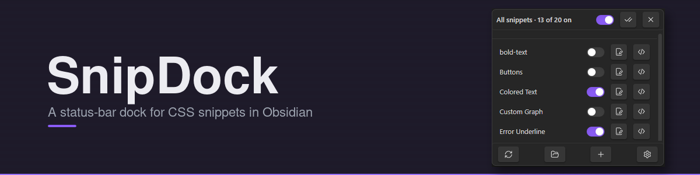
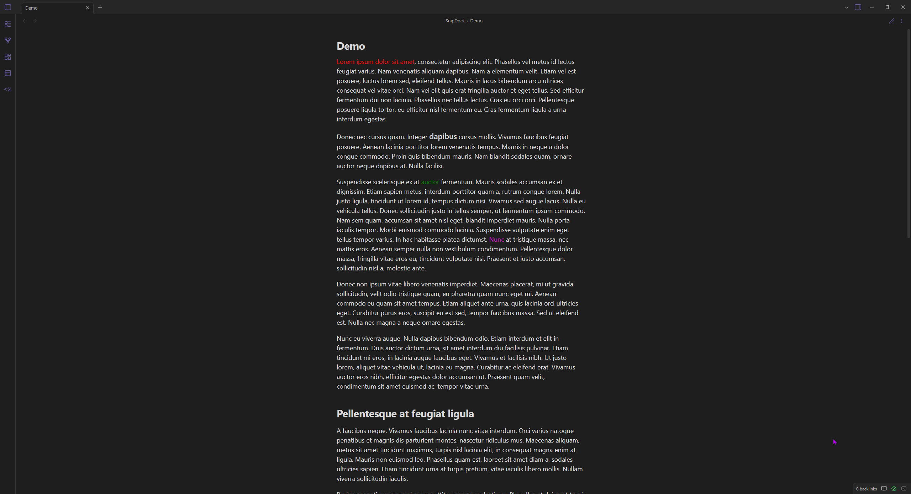
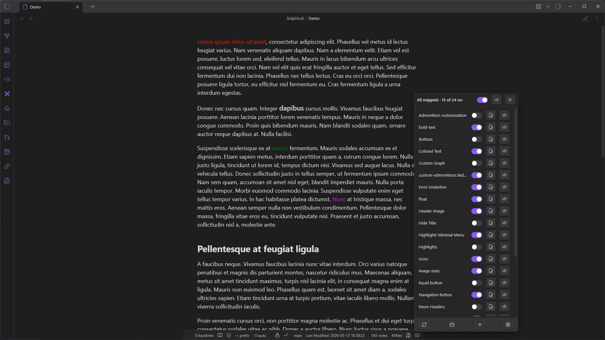
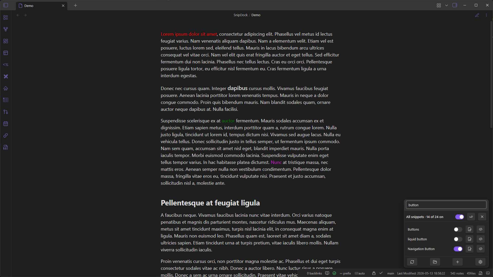
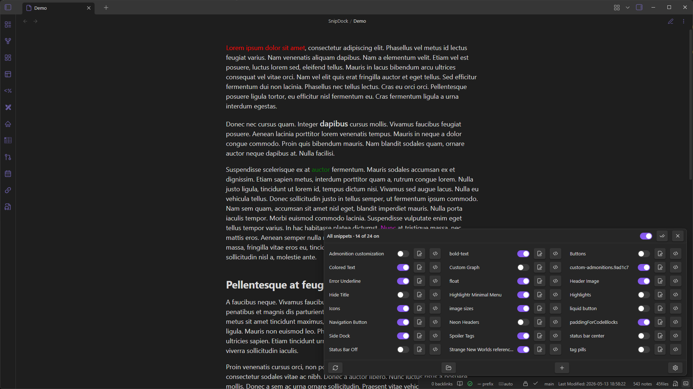
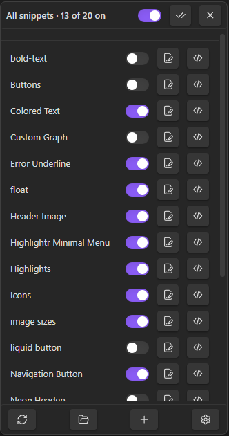
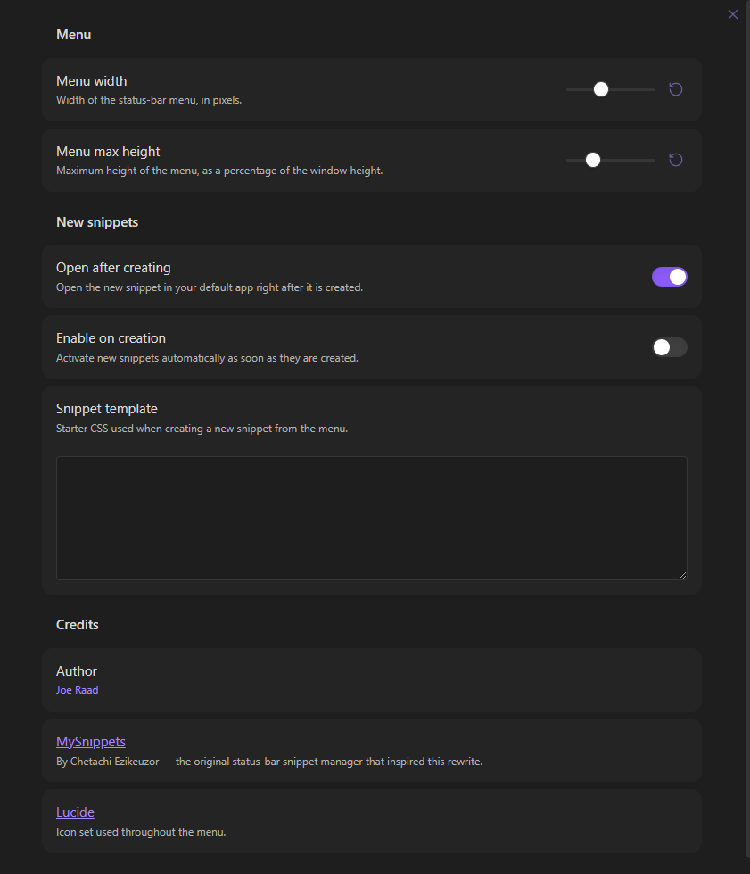

# SnipDock



Status-bar menu for managing CSS snippets in Obsidian. Toggle them, rename them, open them in your editor, and create new ones without leaving the note you're working on.

A rewrite of the unmaintained [MySnippets](https://github.com/chetachiezikeuzor/MySnippets-Plugin) plugin against the current Obsidian API.

---

## Demo



---

## What's new in v1.1.0

### Anchor to status bar icon

New setting to open the menu directly above the SnipDock status-bar icon instead of in the corner of the window. The menu stays pinned just above the bar and grows/shrinks upward as the list changes.

_Suggested by [@Frumkin13](https://github.com/Frumkin13) in [Issue #4](https://github.com/joeraad/obsidian-snipdock/issues/4)._



### Snippet search

Filter the snippet list as you type. New setting adds a search box to the top of the menu that filters the snippet list as you type.

_Suggested by [@ksdavidc](https://github.com/ksdavidc) in [Issue #2](https://github.com/joeraad/obsidian-snipdock/issues/2)._



### Multi-column layout

New setting lays snippets out across multiple columns instead of a single list. Configure the number of columns (2–6); snippets are distributed evenly across them. When enabled, the "Menu width" setting becomes "Column width". The menu is automatically kept within the screen bounds at any column count.

Optionally enable **Column-first sorting** to fill each column top-to-bottom before moving to the next, instead of dealing snippets row-by-row across columns.

_Suggested by [@Bin-T](https://github.com/Bin-T) in [Issue #1](https://github.com/joeraad/obsidian-snipdock/issues/1) and [Issue #7](https://github.com/joeraad/obsidian-snipdock/issues/7)._



---

## Usage

Click the dock icon in the status bar (bottom-right) to open the menu.



The menu has three sections. The top and bottom rows stay pinned; the middle list scrolls.

### Master row

- Master toggle: flips every snippet off and back on. The previously-enabled set is remembered, so toggling back on restores it.
- Check icon: enable all.
- X icon: disable all. No memory.

### Snippet rows

One row per `.css` file in your snippets folder.

- Toggle (or click anywhere on the row) to enable/disable.
- Pencil icon: rename the file. If the snippet was enabled, it gets re-enabled under the new name.
- `</>` icon: open the file in your OS default app for CSS.

### Action row

- Reload: re-read the snippets folder. Useful after adding files outside Obsidian.
- Open folder: opens the snippets folder in your file manager.
- `+`: opens the new-snippet modal. Name + body, body pre-filled from your snippet template. The file lands in `.obsidian/snippets/`; if the folder doesn't exist yet, it gets created.
- List/check/circle icon: cycles the visible snippets through all, enabled only, and disabled only. This combines with the search box when search is enabled, and the selection is remembered between menu openings.
- Gear: jumps to SnipDock's settings.

---

## Commands

| Command                         |                                                        |
| ------------------------------- | ------------------------------------------------------ |
| `Open snippet menu`             | Same as clicking the status-bar icon                   |
| `Create CSS snippet`            | Opens the new-snippet modal                            |
| `Toggle all snippets on or off` | Master switch. Bind a hotkey for fast theme isolation. |

---

## Settings



- Menu width (px) and max height (% of window).
- Anchor to status bar icon: open the menu directly above the icon instead of the window corner.
- Search bar: filter the snippet list as you type.
- Multi-column layout: spread snippets across 2–6 columns; "Menu width" becomes "Column width" when on. Toggle "Column-first sorting" to fill columns top-to-bottom instead of row-by-row.
- Open after creating: open the new file in your editor immediately.
- Enable on creation: turn new snippets on right away.
- Snippet template: starter CSS for new snippets.

---

## Install

In Obsidian: **Settings → Community plugins → Browse**, search for "SnipDock", click **Install**, then **Enable**.

### Manual install

1. Grab `main.js`, `manifest.json`, and `styles.css` from the [latest release](https://github.com/joeraad/obsidian-snipdock/releases).
2. Put them in `<your-vault>/.obsidian/plugins/snipdock/`.
3. In Obsidian: **Settings → Community plugins**, reload, enable SnipDock.

---

## Develop

```bash
npm install
npm run dev     # watch + rebuild
npm run build   # production build, type-checks first
```

The release bundle is just `main.js`, `manifest.json`, `styles.css`.

---

## Contributing

Issues and pull requests are welcome on the [SnipDock repository](https://github.com/joeraad/SnipDock).

- **Bug reports**: include steps to reproduce, your Obsidian version, your OS, and a screenshot or screen recording if the bug is visual.
- **Feature ideas**: open an issue describing the use case before sinking time into a PR. Keeps scope creep in check and avoids work going in the wrong direction.
- **Pull requests**
    1.  Fork the repo and create a feature branch off `main`.
    2.  Run `npm install` then `npm run dev` while you work.
    3.  Keep changes focused, one PR per concern. Match the existing TypeScript style (tabs, double quotes, no `any` casts unless unavoidable).
    4.  Run `npm run build` before pushing. It type-checks first and will fail loudly on errors.
    5.  Describe what the PR changes and why in the body. Screenshots help for any UI tweak.

This plugin has a narrow scope (status-bar snippet management). Suggestions that expand into broader theme or CSS tooling are likely to be declined, but a good issue conversation is the best way to find out.

---

## Credits

- [MySnippets](https://github.com/chetachiezikeuzor/MySnippets-Plugin) by Chetachi Ezikeuzor.
- Icons from [Lucide](https://lucide.dev/).

---

## License

[MIT](LICENSE)
